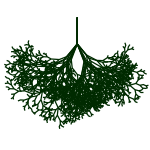

# Shajara

**Shajara** means "Tree" in Arabic.
It is a project for manipulating trees.
There is a tree, there is a node and there is node processor.
 

## License

MIT License

Copyright (c) 2020 Abdelkrime Aries
