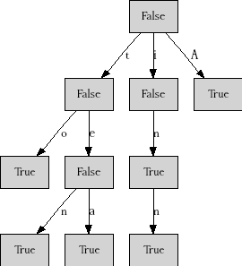
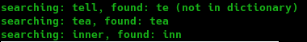

# Shajara


**Shajara** means "Tree" in Arabic.
It is a project for manipulating trees.
There is a tree, there is a node and there is node processor.

[](https://kariminf.github.io/shajara/)
[](https://opensource.org/licenses/MIT)
[](https://pypi.python.org/pypi/shajara)
[](https://pypi.org/project/shajara/)
[](https://pypi.org/project/shajara/)
[](https://shajara.readthedocs.io/en/latest/?badge=latest)
[](https://travis-ci.org/kariminf/shajara)
[](https://codecov.io/gh/kariminf/shajara)
[](https://www.codefactor.io/repository/github/kariminf/shajara/overview/master)
[](https://codebeat.co/projects/github-com-kariminf-shajara-master)
[](https://codeclimate.com/github/kariminf/shajara/)
<br clear="left"/>

## Description

A tree has one node which represents its root.
Each node has a label, a value and many children.
The arc from the parent to the child is labeled.


## Create a tree

### Using shajara API

```python
from shajara import Tree, Node

#create a tree with a root labeled "a"
t = Tree(Node(label="a"))
# add childrend "b", "c" and "d" to "a"
t.add_child("ab", Node(label="b")).add_child("ac", Node(label="c")).add_child("ad", Node(label="d"))
# go to child "b" and add to it children "e" and "f"
t.select_child("ab").add_child("be", Node(label="e")).add_child("bf", Node(label="f"))
# go up to "a", go to child "d" and add to it children "g" and "h"
t.up().select_child("ad").add_child("dg", Node(label="g")).add_child("dh", Node(label="h"))
```


### Using a dict representation

```python
from shajara.create import GenerateProcessor
from shajara import Tree

# the tree representation : the arcs must be labeled
rep = {
    "label": "a",
    "children": {
        "ab": {
            "label": "b",
            "children": {
                "be": {"label": "e"},
                "bf": {"label": "f"}
            }
        },
        "ac": {"label": "c"},
        "ad": {"label": "d"}
    }
}

# Create a generator to this representation
generator = GenerateProcessor(rep)
#create an ampty tree (acrually the root exists without a label or a value)
t = Tree()
#fill the tree using the generator
t.process(processor=generator)
```


## Visualize a tree

DOT description of a tree for Graphviz can be generated using **GraphvizProcessor**

```python
from shajara.plot import graphviz_processor

# create the tree t using one of the methods above
...
#process the tree using graphviz_processor, which returns a DOT description (string)
graph = t.process(processor=graphviz_processor)

# save the description in a file with extension .dot
f = open("graphviz.dot", "w")
f.write(graph)
f.close()

```

## Binary search trees (not balanced)

### Create unbalanced binary search trees

```python
from shajara import Tree, Node
from shajara.search.binary import binary_adder

values = [5, 9, 2, 11, 3, 7, 2]
labels = ["five", "nine", "two", "eleven", "three", "seven", "two_again"]

t = Tree()

for i in range(len(values)):
    binary_adder.set_parameters(Node(value=values[i], label=labels[i]))
    t.process(processor=binary_adder)

```


### Search a value

```python
from shajara.search.binary import binary_searcher

# create a tree t with a binary creator
...

search = [4, 5, 8, 10, 12]

for i in search:
    binary_searcher.set_parameters(value=i)
    rel, node = t.process(processor=binary_searcher)
    if rel == "=" :
        print (str(i) + " is " + node.label)
    elif rel =="<" :
        print (str(i) + " not found. It must be after " + str(node.value))
    else:
        print (str(i) + " not found. It must be before " + str(node.value))

```
The result :


### Search the max and the min

```python
from shajara.search.binary import binary_opti_searcher

# create a tree t with a binary creator
...

binary_opti_searcher.set_parameters(search="min")
min_node = t.process(processor=binary_opti_searcher)
print("The minimum is " + str(min_node.value))

binary_opti_searcher.set_parameters(search="max")
max_node = t.process(processor=binary_opti_searcher)
print("The maximum is " + str(max_node.value))

```
The result :


## Trie

### Create a trie

```python
from shajara.search.trie import trie_adder

strings = ["to", "ten", "inn", "in", "tea", "A"]

t = Tree()
for string in strings:
    trie_adder.set_parameters(string)
    t.process(processor=trie_adder)
```



### Search a word in the trie

```python
from shajara.search.trie import trie_searcher

# create a trie t
...

search = ["tell", "tea", "inner"]
for string in search:
    trie_searcher.set_parameters(string)
    found, node = t.process(processor=trie_searcher)
    is_word = ""
    if not node.value:
        is_word = " (not in dictionary)"
    print("searching: " + string + ", found: " + found + is_word)
```
The result :


## License

MIT License

Copyright (c) 2020 Abdelkrime Aries
